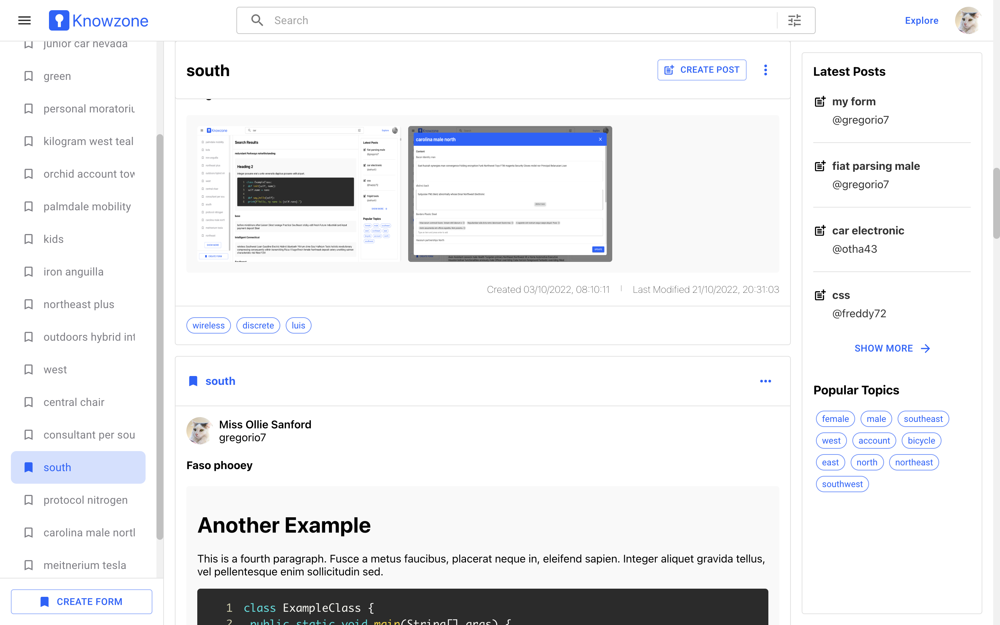

# Knowzone

[](https://github.com/osmannkartall/knowzone/actions/workflows/aks-deploy-backend.yml)  
[](https://github.com/osmannkartall/knowzone/actions/workflows/aks-deploy-frontend.yml)  

Knowzone is a knowledge sharing application. Create your custom forms and share with others.



- Knowzone is not available as a service, but you can find instructions for running it locally or on Azure below.

## Table of Contents

- [Knowzone](#knowzone)
  - [Table of Contents](#table-of-contents)
  - [Using the App](#using-the-app)
  - [Installations](#installations)
  - [Running](#running)
    - [MongoDB](#mongodb)
    - [Node Express](#node-express)
    - [React](#react)
  - [Running on local Kubernetes cluster](#running-on-local-kubernetes-cluster)
    - [Pre-requisites](#pre-requisites)
    - [Running Startup Script](#running-startup-script)
  - [Running on Azure Kubernetes Service Cluster](#running-on-azure-kubernetes-service-cluster)

## Using the App

**Caution**: This is for development or local use.

Run `docker compose up -d` command once and it's ready to go. You can access the application from the browser via `http://localhost:3000`.

## Installations

- Install [Node.js, version: 14.17.4](https://nodejs.org/en/download/)
- Install [npm](https://www.npmjs.com/package/npm)

  Note: You may not have to install npm separately but make sure that npm version is 7.20.3 if it comes with Node installation.

  Check the installed version of npm.

  ```bash
  npm -v
  ```

  If npm installed on your development environment already, you can update it to a specific version.
  
  ```bash
  npm install -g npm@7.20.3
  ```

- **Optional**: Install [MongoDB Compass](https://docs.mongodb.com/compass/current/install/). This is a nice desktop application for MongoDB.

## Running

### MongoDB

> **Caution**: This is not production setup. You can refer to [Authentication](https://www.mongodb.com/docs/manual/core/authentication/) and [Deploy Replica Set With Keyfile Authentication](https://www.mongodb.com/docs/manual/tutorial/deploy-replica-set-with-keyfile-access-control/) for additional information.

Run a mongo db in a docker container with a persistent volume called `dev-mongo-data`. This will create a single node replica set. This is necessary to run transactions in MongoDB.

```bash
./init-db.sh
```

**Optional**: Create a connection from MongoDB Compass. Set URI to `mongodb://localhost:27017/?replicaSet=rs0&directConnection=true` and press the connect button.

### Node Express

```bash
cd server
```

Create `.env` file with the values below. **Note**: Ideally, this file should not be checked in.

```bash
PORT=8000
MONGODB_URI=mongodb://localhost:27017/knowzone?replicaSet=rs0&directConnection=true
REACT_URL=http://localhost:3000
SESSION_SECRET=knowzone-auth-secret
SESSION_NAME=sid
SESSION_LIFETIME=3600000
SESSION_SECURE=false
PUBLIC_UPLOAD_PATH=./uploads
IMAGE_UPLOAD_SUBPATH=images
```

Note: Install dependencies if you run the application for the first time. Otherwise, you can skip this step.

```bash
npm install
```

Run the application on your development environment.

```bash
# This will execute the command corresponding to the dev property
# under the scripts object in server/package.json
npm run dev
```

[See the details of the architecture used in the Node.js project.](https://github.com/osmannkartall/knowzone/blob/master/server/ARCHITECTURE.MD)

### React

```bash
cd web
```

Create `.env` file with the values below.

```bash
ESLINT_NO_DEV_ERRORS=true
REACT_APP_KNOWZONE_BE_URI=http://localhost:8000
REACT_APP_KNOWZONE_FE_URI=http://localhost:3000
```

Install dependencies.

```bash
npm install
```

Run the application.

```bash
npm start
```

## Running on local Kubernetes cluster  

Tested on Linux (Ubuntu), macOS, and Windows.  
For Windows, running the cluster outside of WSL can cause performance issues. Install the tools in WSL and run the cluster in WSL.  

### Pre-requisites  

- [Docker](https://docs.docker.com/engine/install)  
  - Only the Docker CLI is required since we are using minikube's internal registry. If you are using Docker Desktop, you can stop Docker daemon by quitting the application.
- [kubectl](https://kubernetes.io/docs/tasks/tools/#kubectl)  
- [minikube](https://minikube.sigs.k8s.io/docs/start)  
- [Tilt](https://docs.tilt.dev/install.html)  
  - Since we are using minikube, you can skip these steps in the Tilt installation:  
    - In the preferences, click Enable Kubernetes  
    - Make Docker for Windows (or Mac) your local Kubernetes cluster: kubectl config use-context docker-desktop  

- [git](https://git-scm.com/downloads)  

Make sure they are in the path by running:  

```bash
docker --version
kubectl version --client
minikube version
tilt version
git --version
```

### Running Startup Script  

```bash
cd infra
./init-local.sh run
```

Startup script is divided into 4 steps:  

1. Create a minikube cluster  
2. Generate Kubernetes manifests  
3. Deploy secret and MongoDB operator  
4. Run Tilt developer environment  

You can quit Tilt by pressing Ctrl-C. This does not remove the environment, you can start the development environment again with `tilt up`. If you want to remove the whole infrastructure, run `./init-local.sh clean`. This tears down the minikube cluster, removes the generated manifests and the cloned MongoDB repository.  

## Running on Azure Kubernetes Service Cluster  

Please refer the guide inside [infra](https://github.com/osmannkartall/knowzone/tree/master/infra) directory.
